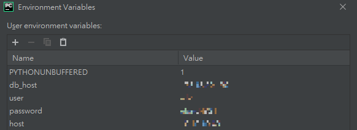
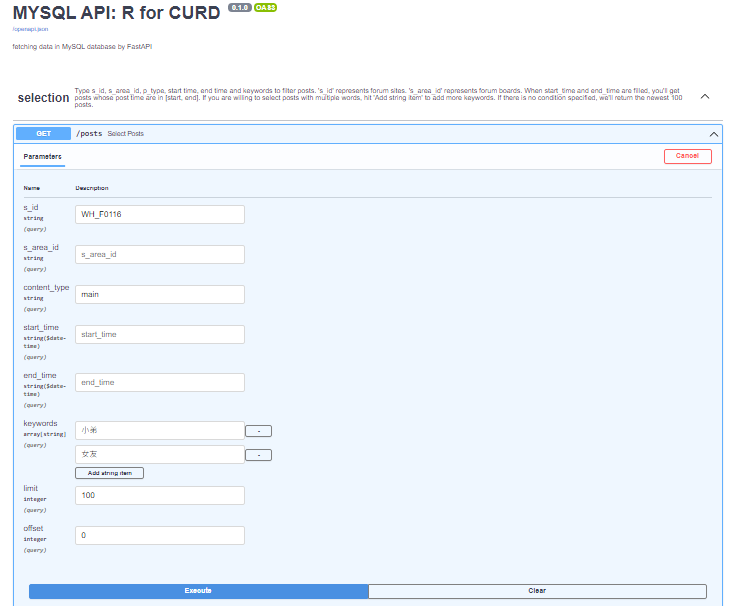
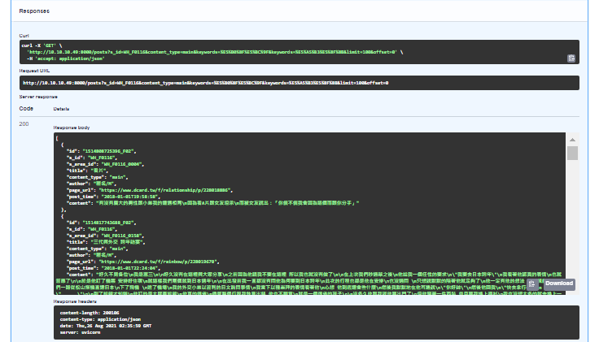

Provides an easy way to fetch data from database.
- - -
**Structure**
- - -
    mysql_api/
    ├── README.md   
    ├── requirements.txt
    ├── .gitignore
    ├── object
    │   └── __init__.py
    │   └── database.py
    │   └── schema.py
    └── utilities
        └── __init__.py
        └── tools.py
- - -
**Instructions**
- - -
1.  Set environment variables in 'app' configuration.
   

2.  Run app.py script.
3.  Send requests to access posts. For example, you can fetch posts on WH_F0116(Dcard) which contain both 小弟 and 女友 by the code below.

        import requests 
    
        response = requests.get(url=api_url, params=query_params={'s_id': 'WH_F0116','keywords': ['小弟', '女友']})

All feasible query parameters are:
s_id, s_area_id, content_type, start_time, end_time, keywords, limit, offset.
- - -
**Example**
- - -
You can experience it by entering this path: '<api_url>/docs'.

 
 
